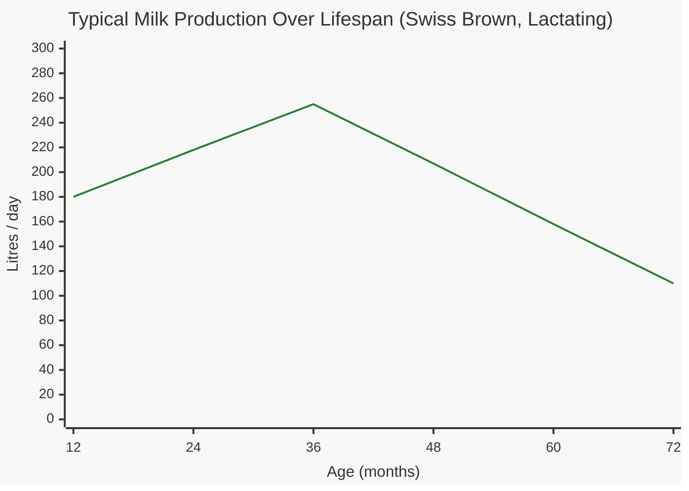

# Cattle Factsheet

Cattle are the most diverse livestock in Realistic Livestock RM, with 7 breeds ranging from high-output dairy cows to premium beef cattle. Each breed has distinct milk output, sell value, and feed requirements. Bulls are heavier and sell for more, but produce no milk.

> **Note:** This documentation was generated with AI assistance and may contain inaccuracies. If you spot an error, please [open an issue](https://github.com/rittermod/FS25_RealisticLivestockRM/issues).

---

## Breeds at a Glance

| Breed | Type | Target Weight | Milk Range (peak, lactating) | Sell Value |
|-------|------|--------------|------------------------------|------------|
| **Holstein** | Dairy | 575 / 650 kg | 65 – 750 L/day | Moderate |
| **Hereford** | Dual | 675 / 750 kg | 55 – 600 L/day | Above average |
| **Swiss Brown** | Dual | 650 / 850 kg | 50 – 580 L/day | Above average |
| **Angus** | Beef | 700 / 900 kg | 30 – 365 L/day | High |
| **Highland** | Beef | 725 / 950 kg | 30 – 365 L/day | High, retains value in old age |
| **Limousin** | Beef | 630 / 675 kg | 30 – 320 L/day | Highest |
| **Water Buffalo** | Special | 425 / 500 kg | 5 – 70 L/day | Low |

*Target weights shown as cow / bull. Milk range shows the full span from poor to excellent genetics. All cows produce milk when lactating — beef breeds just produce less.*

> **Breed-locking:** Water Buffalo bulls can only breed with Water Buffalo cows. All other bull breeds can breed with any non-Water-Buffalo cow.

---

## Milk Production by Breed

Cows produce milk **only while lactating** (10 months after giving birth). Non-lactating cows produce zero milk.

### Milk Output Range (L/day, lactating cow)

| Breed | 12 mo | 36 mo (peak) | 72 mo |
|-------|-------|--------------|-------|
| **Holstein** | 40 – 445 | **65 – 750** | 35 – 410 |
| **Hereford** | 40 – 435 | **55 – 600** | 25 – 285 |
| **Swiss Brown** | 35 – 410 | **50 – 580** | 20 – 250 |
| **Angus** | 20 – 230 | **30 – 365** | 15 – 160 |
| **Highland** | 20 – 230 | **30 – 365** | 15 – 160 |
| **Limousin** | 20 – 205 | **30 – 320** | 10 – 115 |
| **Water Buffalo** | 5 – 70 | 5 – 70 | 5 – 70 |

*Genetics and lactation phase cause large variation between individual animals. Most cows produce somewhere in the middle of these ranges. CVM carrier cows produce even more than the upper range.*

*Water Buffalo milk stays flat regardless of age — very low output compared to other breeds.*

*Chart shows Swiss Brown as a representative mid-range breed with average genetics. Holstein produces more, beef breeds produce less — see the table above for per-breed ranges.*

---

## Sell Prices by Breed

Bulls consistently sell for more than cows at all ages. Beef breeds (Angus, Limousin, Highland) command significantly higher prices than dairy breeds.

### Typical Sell Prices ($)

| Breed | | Newborn | 24 mo | 36 mo (peak) | 60 mo |
|-------|---|---------|-------|--------------|-------|
| **Swiss Brown** | Cow | 150 | 2,000 | 2,400 | 1,400 |
| | Bull | 220 | 2,400 | 2,800 | 1,800 |
| **Holstein** | Cow | 135 | 1,900 | 2,000 | 1,100 |
| | Bull | 200 | 2,250 | 2,600 | 1,500 |
| **Angus** | Cow | 200 | 2,800 | 3,800 | 2,000 |
| | Bull | 245 | 3,200 | 4,100 | 2,300 |
| **Limousin** | Cow | 225 | 2,950 | 4,000 | 2,200 |
| | Bull | 275 | 3,450 | 4,400 | 2,550 |
| **Hereford** | Cow | 210 | 2,200 | 2,800 | 1,600 |
| | Bull | 225 | 2,400 | 3,000 | 1,800 |
| **Highland** | Cow | 230 | 3,000 | 3,500 | 2,500 |
| | Bull | 280 | 3,500 | 4,000 | 3,000 |
| **Water Buffalo** | Cow | 150 | 1,500 | 1,500 | 1,000 |
| | Bull | 200 | 1,750 | 2,000 | 1,250 |

*These are typical prices for an average, healthy animal. Actual prices vary widely — well-bred healthy animals sell for significantly more, while sick or poor-quality animals can sell for far less.*

### What Affects Sell Price

| Factor | Effect |
|--------|--------|
| Quality genetics | Better genetics → noticeably higher price |
| Weight | Well-fed animals near target weight are worth more |
| Health | Healthy animals sell for significantly more |
| Lactating | Small price bonus |
| Pregnant | Moderate price bonus |
| Castrated | Small price bonus |
| Diseases | Can substantially reduce price |

---

## Buy Prices by Breed

| Breed | Cow (newborn) | Cow (adult) | Bull (newborn) | Bull (adult) |
|-------|--------------|-------------|----------------|--------------|
| **Swiss Brown** | 200 | 2,400 | 250 | 2,700 |
| **Holstein** | 200 | 2,200 | 235 | 2,500 |
| **Angus** | 275 | 3,200 | 300 | 3,200 |
| **Limousin** | 320 | 3,400 | 350 | 3,750 |
| **Hereford** | 225 | 2,400 | 250 | 2,500 |
| **Highland** | 300 | 3,000 | 350 | 3,500 |
| **Water Buffalo** | 200 | 1,500 | 250 | 1,800 |

*Adult prices are at age 24–36 months. Dealer animals have randomised genetics.*

---

## Food & Water Consumption by Breed

Genetics significantly affect how much each animal eats — some are naturally much more efficient than others. Lactating cows eat considerably more, and the Food Scale setting also adjusts consumption.

### Food Consumption Range (L/day)

| Breed | | Newborn | 18+ mo (adult) |
|-------|---|---------|-----------------|
| **Swiss Brown** | Cow | 25 – 175 | 85 – 600 |
| | Bull | 25 – 175 | 90 – 620 |
| **Holstein** | Cow | 25 – 160 | 85 – 580 |
| | Bull | 25 – 160 | 85 – 595 |
| **Angus** | Cow | 20 – 140 | 110 – 770 |
| | Bull | 20 – 140 | 115 – 790 |
| **Limousin** | Cow | 20 – 150 | 120 – 840 |
| | Bull | 20 – 150 | 125 – 860 |
| **Hereford** | Cow | 15 – 115 | 95 – 665 |
| | Bull | 20 – 125 | 105 – 735 |
| **Highland** | Cow | 20 – 140 | 140 – 960 |
| | Bull | 20 – 140 | 145 – 1,005 |
| **Water Buffalo** | Cow | 10 – 70 | 90 – 615 |
| | Bull | 10 – 80 | 95 – 655 |

*Highland and Limousin are the most expensive breeds to feed. Ranges show the span from the most efficient to the hungriest animals. Most animals eat near the middle of these ranges.*

### Water Consumption (L/day, newborn → adult)

| Breed | Cow | Bull |
|-------|-----|------|
| **Swiss Brown** | 55 → 130 | 55 → 130 |
| **Holstein** | 45 → 120 | 45 → 120 |
| **Angus** | 65 → 180 | 65 → 180 |
| **Limousin** | 70 → 200 | 70 → 200 |
| **Hereford** | 60 → 150 | 65 → 160 |
| **Highland** | 20 → 140 | 20 → 140 |
| **Water Buffalo** | 20 → 140 | 20 → 140 |

*Lactating cows drink considerably more water than usual.*

---

## Weights by Breed

| Breed | | Birth | Target | Maximum |
|-------|---|-------|--------|---------|
| **Swiss Brown** | Cow | 40 kg | 650 kg | 1,200 kg |
| | Bull | 40 kg | 850 kg | 1,400 kg |
| **Holstein** | Cow | 42 kg | 575 kg | 1,200 kg |
| | Bull | 45 kg | 650 kg | 1,400 kg |
| **Angus** | Cow | 32 kg | 700 kg | 1,200 kg |
| | Bull | 35 kg | 900 kg | 1,400 kg |
| **Limousin** | Cow | 36 kg | 630 kg | 1,200 kg |
| | Bull | 39 kg | 675 kg | 1,400 kg |
| **Hereford** | Cow | 33 kg | 675 kg | 1,200 kg |
| | Bull | 35 kg | 750 kg | 1,400 kg |
| **Highland** | Cow | 35 kg | 725 kg | 1,200 kg |
| | Bull | 35 kg | 950 kg | 1,600 kg |
| **Water Buffalo** | Cow | 35 kg | 425 kg | 1,200 kg |
| | Bull | 36 kg | 500 kg | 1,400 kg |

*Higher metabolism animals reach target weight faster but eat more. Castrated animals grow faster than intact males.*

---

## Reproduction

All cattle breeds share the same reproduction rules:

| Parameter | Value |
|-----------|-------|
| Cow breeding age | 12+ months |
| Bull breeding age | 12+ months |
| Bull retires at | 132 months (11 years) |
| Cow fertility ends | 132 months (11 years) |
| Gestation | 10 months |
| Lactation duration | 10 months after birth |

### Offspring per Birth

| Age of Cow | No Birth | 1 Calf | Twins | Triplets |
|------------|----------|--------|-------|----------|
| 12–28 mo | Moderate | Most likely | Rare | Very rare |
| 29–48 mo (prime) | Low | Most likely | Rare | Very rare |
| 49–84 mo | Increasing | Most likely | Rare | Very rare |
| 85–132 mo (old) | Very common | Less likely | Very rare | Extremely rare |

*Healthy cows are much more likely to produce offspring. Low health increases the chance of no birth and complications.*

### Breeding Restrictions

- Water Buffalo bulls can **only** breed Water Buffalo cows
- All other bull breeds can cross-breed with any other cow breed
- A bull will not breed with a cow that's already pregnant
- A bull will not breed with his own daughters

---

## Lifespan & Death

| Event | Age |
|-------|-----|
| Fertility ends | 132 months (11 years) |
| Old age deaths begin | 180 months (15 years) |
| Maximum lifespan | ~240 months (20 years) |

*Death can be toggled off in settings. Accidents can happen at any age (affected by weather).*

---

## Diseases

| Disease | Spread | Fatal? | Treatment | Impact on Cows |
|---------|--------|--------|-----------|----------------|
| **Mastitis** | Slowly | No | Quick, affordable | Stops all milk production |
| **Foot & Mouth** | Moderately | Yes | Slow, moderate cost | Severe milk reduction, major price loss |
| **CVM** | Genetic only | Calves die | None | Carrier cows produce extra milk |

*Mastitis only affects lactating cows. See the [Disease Guide](guide-diseases.md) for detailed prevention and treatment.*

---

## Tips

1. **Dairy farming:** Holstein cows produce the most milk by far. Keep them breeding regularly — non-lactating cows produce zero milk.

2. **Beef farming:** Limousin and Angus sell for the highest prices. Highland cattle retain good value even in old age, making them lower-maintenance for long-term herds.

3. **CVM gamble:** CVM carrier cows are exceptional milk producers, but breeding two carriers together risks losing calves. High risk, high reward.

4. **Water Buffalo** are a niche choice with very low milk output. They require their own breed-specific bull. Not recommended for dairy income.

5. **Bulls sell for more** than cows at every age. If you're selling calves, bulls are more profitable. Castrated animals also get a small price bonus.
