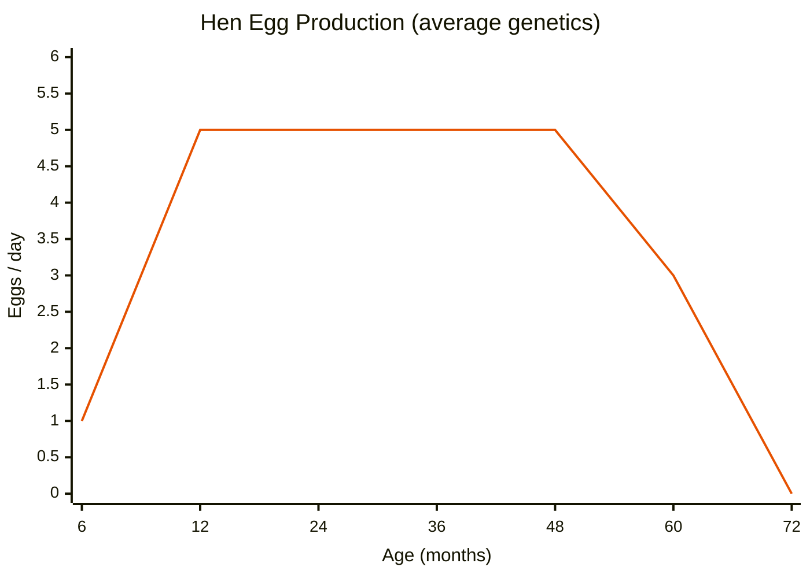

# Chickens Factsheet

Chickens are the cheapest and shortest-lived animals in Realistic Livestock RM. Hens produce eggs without needing a rooster, but hatching chicks requires one. There's only one breed — the key difference is between hens (egg layers) and roosters (breeding enablers, no eggs).

> **Note:** This documentation was generated with AI assistance and may contain inaccuracies. If you spot an error, please [open an issue](https://github.com/rittermod/FS25_RealisticLivestockRM/issues).

---

## At a Glance

| Stat | Hen | Rooster |
|------|-----|---------|
| **Target Weight** | 3.25 kg | 4.25 kg |
| **Max Weight** | 4.5 kg | 5.5 kg |
| **Birth Weight** | 0.04 kg | 0.045 kg |
| **Egg Range (peak)** | **1 – 9 eggs/day** | — |
| **Buy Price (adult)** | $30 | $30 |
| **Sell Price (adult)** | $1 – $45 | $1 – $45 |

*Roosters are heavier but eat noticeably less food than hens at adult age. Sell prices vary with genetics and health but chickens are always low-value — their worth is in egg production.*

---

## Egg Production (Hens Only)

Hens lay eggs regardless of whether a rooster is present — a rooster is only needed for hatching chicks. Egg production follows an age-based curve.

### Egg Output Range (eggs/day)

| Age | Range |
|-----|-------|
| 0–5 mo | 0 |
| 6 mo | 0 – 2 |
| 12–48 mo (peak) | **1 – 9** |
| 60 mo | 1 – 5 |
| 72+ mo | 0 |

*Egg production peaks at 12 months and holds steady until 48 months, then declines to zero by 72 months (6 years). Genetics cause large variation between individual hens. Avian Influenza stops ALL egg production.*

*Chart shows average genetics — individual hens will vary above and below this line.*

---

## Sell & Buy Prices

Chicken prices are low and identical for hens and roosters:

| Age | Buy Price | Sell Price |
|-----|----------|------------|
| Newborn | $3 | $2 |
| Adult (36 mo) | $30 | $25 |

*Actual sell prices vary — well-bred healthy chickens sell for more, while sick birds sell for less. Even at peak value chickens are worth very little. Their value is in egg production.*

### What Affects Sell Price

| Factor | Effect |
|--------|--------|
| Quality genetics | Better genetics → noticeably higher price |
| Health | Healthy birds sell for more |
| Avian Influenza | Drastically reduces price |

---

## Food & Water

### Food Consumption Range (L/day)

| Age | Hen | Rooster |
|-----|-----|---------|
| Newborn | 0 – 2 | 0 – 2 |
| 6 mo | 1 – 5 | 1 – 5 |
| 18+ mo (adult) | **2 – 12** | **1 – 9** |

*Roosters eat noticeably less than hens at adult age. Ranges show the span from the most efficient to the hungriest birds.*

### Water & Straw (L/day)

| Age | Water (both) | Straw (both) |
|-----|-------------|-------------|
| Newborn | 0 | 1 |
| 6 mo | 3 | 3 |
| 18+ mo | 4–5 | 3 |

---

## Reproduction

| Parameter | Value |
|-----------|-------|
| Hen breeding age | 6+ months |
| Rooster max breeding age | No limit (breeds for life) |
| Hen fertility | Declines sharply with age |
| Gestation (hatching) | 2 months |
| Min health to breed | 75% |

> **Eggs vs chicks:** Hens lay eggs as an output product automatically (no rooster needed). But to **hatch chicks** (reproduction), a rooster must be in the same pen.

### Chicks per Hatch

Chickens can produce large broods, but the chance of no offspring is always significant:

| Hen Age | No Hatch | Small Brood (1–5) | Typical Brood (5–7) | Large Brood (7–12) |
|---------|----------|-------------------|--------------------|--------------------|
| 6–12 mo | Common | Uncommon | Most likely | Possible |
| 12–24 mo | Common | Uncommon | Most likely | Possible |
| 24–48 mo | Frequent | Uncommon | Less likely | Rare |
| 48–84 mo | Very common | Rare | Rare | Very rare |
| 84–120 mo | Almost always | Very rare | Very rare | — |

*Unlike other animals, hens never die during hatching. The most common successful brood is 5–7 chicks.*

---

## Lifespan & Death

| Event | Age |
|-------|-----|
| Egg production ends | ~72 months (6 years) |
| Old age deaths begin | 60 months (5 years) |
| Maximum lifespan | ~96 months (8 years) |

*Chickens have the shortest lifespan. Old age deaths can begin while hens are still laying eggs. Breeding success drops sharply with age — old hens rarely hatch chicks. Death can be toggled off in settings.*

---

## Diseases

| Disease | Spread | Fatal? | Treatment | Impact |
|---------|--------|--------|-----------|--------|
| **Avian Influenza** | Rapidly | Yes, high fatality | **None** | Stops ALL egg production, major price loss |

> **Avian Flu is untreatable.** It spreads fast, kills many infected birds, and completely stops egg production. Infected chickens that survive gain immunity, but an outbreak can devastate a flock. See the [Disease Guide](guide-diseases.md).

---

## Tips

1. **Hens don't need roosters for eggs.** You only need a rooster if you want to hatch chicks. A pen full of hens produces maximum eggs with zero breeding overhead.

2. **Peak production is 12–48 months.** Buy young hens and plan to replace them before they hit 48 months (4 years) when production starts declining.

3. **Avian Flu is devastating.** No treatment exists. Sell infected birds quickly to limit spread and recover some value. Keeping smaller flocks in separate pens also limits outbreak damage.

4. **Cheap but productive.** At $3 per chick and up to 9 eggs/day at peak, chickens have the best return-on-investment for small farms. The initial cost is negligible.

5. **Short lifespan warning.** Chickens can start dying of old age at just 5 years — while they're still laying. Sell older hens before they die to recover whatever small value they have.
