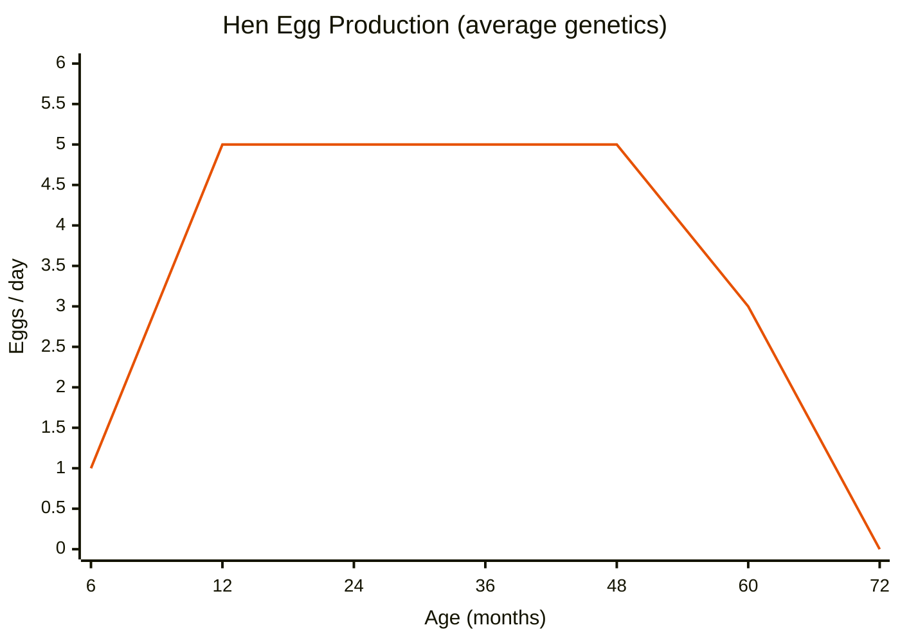

# Chickens Factsheet

Chickens are the cheapest and shortest-lived animals in Realistic Livestock RM. Hens produce eggs without needing a rooster, but hatching chicks requires one. There's only one breed - the key difference is between hens (egg layers) and roosters (breeding enablers, no eggs).

> **Note:** This documentation was generated with AI assistance and may contain inaccuracies. If you spot an error, please [open an issue](https://github.com/rittermod/FS25_RealisticLivestockRM/issues).

---

## At a Glance

| Stat | Hen | Rooster |
|------|-----|---------|
| **Target Weight** | 3.25 kg | 4.25 kg |
| **Max Weight** | 4.5 kg | 5.5 kg |
| **Birth Weight** | 0.04 kg | 0.045 kg |
| **Egg Range (peak)** | **1 - 9 eggs/day** | - |
| **Buy Price (adult)** | $30 | $30 |
| **Sell Price (adult)** | $1 - $45 | $1 - $45 |

*Roosters are heavier but eat noticeably less food than hens at adult age. Sell prices vary with genetics and health but chickens are always low-value - their worth is in egg production.*

---

## Egg Production (Hens Only)

Hens lay eggs regardless of whether a rooster is present - a rooster is only needed for hatching chicks. Egg production follows an age-based curve.

### Egg Output Range (eggs/day)

| Age | Range |
|-----|-------|
| 0-5 mo | 0 |
| 6 mo | 0 - 2 |
| 12-48 mo (peak) | **1 - 9** |
| 60 mo | 1 - 5 |
| 72+ mo | 0 |

*Egg production peaks at 12 months and holds steady until 48 months, then declines to zero by 72 months (6 years). Genetics cause large variation between individual hens. With Avian Flu (LPAI), egg production drops to about 40% of normal while a bird is sick.*

```mermaid
%%{init: {"themeVariables": {"xyChart": {"plotColorPalette": "#e65100"}}}}%%
xychart-beta
    title "Hen Egg Production (average genetics)"
    x-axis "Age (months)" [6, 12, 24, 36, 48, 60, 72]
    y-axis "Eggs / day" 0 --> 6
    line [1, 5, 5, 5, 5, 3, 0]
```

*Chart shows average genetics - individual hens will vary above and below this line.*

---

## Sell & Buy Prices

Chicken prices are low and identical for hens and roosters:

| Age | Buy Price | Sell Price |
|-----|----------|------------|
| Newborn | $3 | $2 |
| Adult (36 mo) | $30 | $25 |

*Actual sell prices vary - well-bred healthy chickens sell for more, and a sick bird is worth less while sick. Even at peak value chickens are worth very little. Their value is in egg production.*

### What Affects Sell Price

| Factor | Effect |
|--------|--------|
| Quality genetics | Better genetics -> noticeably higher price |
| Weight | Well-fed birds near target weight are worth more |
| Health | Healthy birds sell for more |
| Avian Flu (LPAI) | Drastically reduces price |

---

## Food & Straw

### Food Consumption Range (L/day)

| Age | Hen | Rooster |
|-----|-----|---------|
| Newborn | 0 - 2 | 0 - 2 |
| 6 mo | 1 - 5 | 1 - 5 |
| 12+ mo (adult) | **2 - 12** | **1 - 9** |

*Roosters eat noticeably less than hens at adult age. Ranges show the span from the most efficient to the hungriest birds.*

### Straw Consumption (L/day)

| Age | Straw (both) |
|-----|-------------|
| Newborn | 1 |
| 6 mo | 3 |
| 12+ mo | 7 |

*Chickens have no water input. Straw is not affected by genetics.*

---

## Reproduction

| Parameter | Value |
|-----------|-------|
| Hen breeding age | 6+ months |
| Rooster breeding age | 6+ months |
| Rooster max breeding age | 72 months (6 years) |
| Hen fertility | Declines with age; ends by ~60 months (5 years) |
| Gestation (hatching) | 2 months |
| Min health to breed | 75% |

*See the [Breeding Reference](reference-breeding.md) for a side-by-side table of breeding ages, gestation, and litter sizes across all species.*

> **Eggs vs chicks:** Hens lay eggs as an output product automatically (no rooster needed). But to **hatch chicks** (reproduction), a rooster must be in the same pen.

### Chicks per Hatch

A successful hatch is typically around 5 chicks, and can reach up to 12 from a highly fertile hen:

| Outcome | Likelihood |
|---------|------------|
| ~5 chicks (typical) | Most likely |
| Fewer chicks | Common |
| Up to 12 chicks | Possible with high fertility |

*Hatch size does not depend on age. A hen's chance of hatching a clutch is high from 6 months and tapers with age, ending abruptly at 60 months (5 years) - after that she still lays eggs but hatches no chicks. A hen must be at 75% health or above to hatch a clutch.*

---

## Lifespan & Death

| Event | Age |
|-------|-----|
| Egg production ends | ~72 months (6 years) |
| Old age deaths begin | 60 months (5 years) |
| Maximum lifespan | ~96 months (8 years) |

*Chickens have the shortest lifespan. Old age deaths can begin while hens are still laying eggs. Hens stop hatching chicks entirely at 60 months - the same age old-age deaths begin. Death can be toggled off in settings.*

---

## Diseases

| Disease | Spread | Fatal? | Treatment | Impact |
|---------|--------|--------|-----------|--------|
| **Avian Flu (LPAI)** | Rapidly | Yes, high fatality | **None** | Egg production drops to about 40% of normal while a bird is sick, severe price loss |

> **Avian Flu is untreatable.** It spreads fast and kills many infected birds, and egg production drops to about 40% of normal while a bird is sick. Infected chickens that survive gain immunity for about two years, but an outbreak can devastate a flock. See the [Disease Guide](guide-diseases.md).

---

## Tips

1. **Hens don't need roosters for eggs.** You only need a rooster if you want to hatch chicks. A pen full of hens produces maximum eggs with zero breeding overhead.

2. **Peak production is 12-48 months.** Buy young hens and plan to replace them before they hit 48 months (4 years) when production starts declining.

3. **Avian Flu is devastating.** No treatment exists, and sick birds cannot be sold - cull them from the Diseases dialog to limit spread. Keeping smaller flocks in separate pens also limits outbreak damage.

4. **Cheap but productive.** At $3 per chick and up to 9 eggs/day at peak, chickens have the best return-on-investment for small farms. The initial cost is negligible.

5. **Short lifespan warning.** Chickens can start dying of old age at just 5 years - while they're still laying. Sell older hens before they die to recover whatever small value they have.
