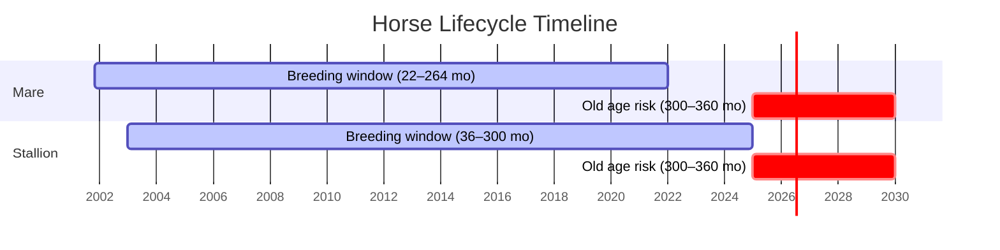

# Horses Factsheet

Horses are the longest-lived and most valuable animals in Realistic Livestock RM. They produce no milk, wool, or eggs — their value comes from sell price, which is uniquely influenced by riding, fitness, and cleanliness. All 8 colour variants have identical stats, so colour is purely cosmetic.

> **Note:** This documentation was generated with AI assistance and may contain inaccuracies. If you spot an error, please [open an issue](https://github.com/rittermod/FS25_RealisticLivestockRM/issues).

---

## Breeds at a Glance

All horse breeds share identical stats. The only difference is appearance:

| Colour Variants |
|----------------|
| Bay, Black, Chestnut, Dun, Gray, Palomino, Pinto, Seal Brown |

| Stat | Mare | Stallion |
|------|------|----------|
| **Target Weight** | 500 kg | 575 kg |
| **Max Weight** | 900 kg | 1,000 kg |
| **Birth Weight** | 45 kg | 48 kg |
| **Buy Price (adult)** | $5,000 | $6,000 |
| **Sell Price (peak)** | $2,000 – $10,000+ | $2,500 – $12,000+ |

*Stallions are heavier and sell for more than mares. Sell price varies enormously based on health, riding, fitness, and cleanliness — a well-maintained horse is worth several times more than a neglected one.*

---

## Sell Prices

Unlike other animals, horse prices **increase with age** and peak at 60+ months (not 36 months like cattle).

### Typical Sell Prices ($)

| Age | Mare | Stallion |
|-----|------|----------|
| Newborn | 400 | 500 |
| 36 mo | 5,000 | 5,400 |
| 60 mo | **5,500** | **6,000** |

### What Makes Horse Prices Special

Horse sell prices use a unique system heavily influenced by the animal's condition:

| Factor | Importance | What It Means |
|--------|------------|---------------|
| **Health** | Most important | Keep horses healthy — this is the biggest factor |
| **Riding** | Very important | Ride your horses regularly for higher value |
| **Fitness** | Important | Exercise improves value |
| **Dirt** | Penalty | Dirty horses lose value |
| Quality genetics | Multiplier | Better genetics → higher base value |
| Weight | Multiplier | Over/underweight affects price |

A well-maintained horse (healthy, ridden, fit, clean) with good genetics can sell for significantly more than typical price. A neglected horse can be worth very little.

### Buy Prices

| Age | Mare | Stallion |
|-----|------|----------|
| Newborn | 500 | 650 |
| Adult (36 mo) | 5,000 | 6,000 |

---

## Food & Water

All breeds and both genders consume the same amount.

### Food Consumption Range (L/day)

| Age | Range |
|-----|-------|
| Newborn | 13 – 88 |
| 18+ mo (adult) | **100 – 700** |

*Genetics cause large variation between individual animals. Most horses eat near the middle of these ranges. Horses do not have a lactation food bonus. The Food Scale setting also adjusts consumption.*

### Water & Straw (L/day)

| Age | Water | Straw |
|-----|-------|-------|
| Newborn | 10 | 5 |
| 18+ mo (adult) | 50 | 80 |

---

## Output

Horses produce **manure only** — no milk, wool, or eggs.

| Age | Manure (both genders) |
|-----|----------------------|
| Newborn | 20 |
| 18+ mo | 200 |

---

## Reproduction

| Parameter | Value |
|-----------|-------|
| Mare breeding age | 22+ months |
| Stallion breeding age | 36+ months |
| Stallion max breeding age | 300 months (25 years) |
| Mare fertility ends | 264 months (22 years) |
| Gestation | 11 months (longest of all species) |
| Min health to breed | 75% |

### Offspring per Birth

Horses almost always produce a single foal. Multiple births are rare:

| Outcome | Likelihood |
|---------|------------|
| 1 foal | Almost always |
| Twins | Rare |
| Triplets | Very rare |

### Fertility by Age

Horses have a very long fertile period but fertility declines gradually:

| Mare Age | Breeding Success |
|----------|-----------------|
| 22–48 mo | High |
| 48–108 mo | Good |
| 108–180 mo | Moderate, declining |
| 180–264 mo | Low |
| 264+ mo | Infertile |

*With 11 months of gestation, a mare can produce roughly one foal per year during her prime.*

---

## Lifespan & Death

| Event | Age |
|-------|-----|
| Mare stops breeding | 264 months (22 years) |
| Stallion stops breeding | 300 months (25 years) |
| Old age deaths begin | 300 months (25 years) |
| Maximum lifespan | ~360 months (30 years) |

*Horses live the longest of all animals. A well-cared-for horse can provide 20+ years of service. Death can be toggled off in settings.*

*Timeline shows key phases in a horse's life. Birth = Year 0. Horses have the longest lifespan — over 20 years of breeding potential before old age risk begins.*

---

## Diseases

**Horses have no diseases** in Realistic Livestock RM. They are the only species completely immune to all disease mechanics.

---

## Tips

1. **Ride and exercise your horses.** Health, riding, and fitness together are far more important to sell price than genetics. A well-maintained horse is worth far more than a neglected one.

2. **Keep them clean.** Dirty horses lose noticeable value. Clean horses regularly.

3. **Long-term investment.** With 11-month gestation and single foals, horse breeding is slow but foals are very valuable. One healthy, well-ridden horse at 60 months can sell for well above $5,000.

4. **Colour is cosmetic.** Don't pay extra for a specific colour — all 8 variants have identical stats. Pick whichever you like.

5. **Stallions hold value longer.** Stallions can breed until 25 years and their sell price peaks later. They're worth keeping longer than mares.
