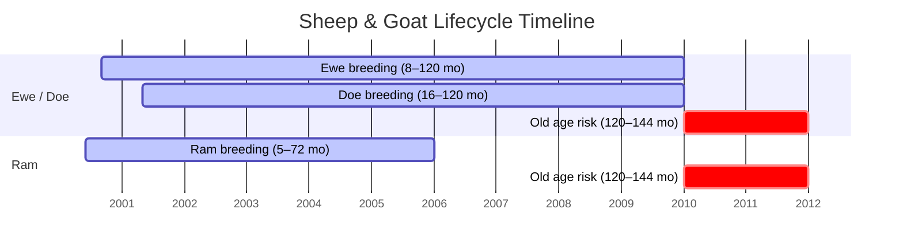

# Sheep & Goats Factsheet

Sheep and goats share a husbandry but have different production types. Sheep produce wool (warm weather only), while goats produce goat milk (requires lactation). Four sheep breeds offer different wool/price trade-offs, and goats are a distinct breed-locked type.

> **Note:** This documentation was generated with AI assistance and may contain inaccuracies. If you spot an error, please [open an issue](https://github.com/rittermod/FS25_RealisticLivestockRM/issues).

---

## Breeds at a Glance

### Sheep

| Breed | Target Weight (ewe / ram) | Wool Range (peak) | Sell Value |
|-------|--------------------------|-------------------|------------|
| **Black Welsh** | 42 / 57.5 kg | 24 – 166 | Lowest |
| **Landrace** | 45 / 60 kg | 21 – 149 | Below average |
| **Steinschaf** | 50 / 67.5 kg | 18 – 123 | Above average |
| **Swiss Mountain** | 80 / 105 kg | 14 – 96 | Highest |

*Black Welsh produce the most wool by far, but Swiss Mountain sell for double the price. Wool range shows the full span from poor to excellent genetics.*

### Goat

| Breed | Target Weight (doe / ram) | Goat Milk Range (peak, lactating) | Sell Value |
|-------|--------------------------|----------------------------------|------------|
| **Goat** | 30 / 35 kg | 5 – 57 L/day | High |

*Rams are heavier than ewes/does.*

> **Breed-locking:** Ram Goats can only breed with Goats. Other rams can breed with any sheep breed but not with Goats.

---

## Wool Production (Sheep Only)

Both ewes and rams produce wool — identical output per breed. **Wool is only produced when temperature is 12°C or above** (warm weather shearing season). In winter, wool output drops to zero.

### Wool Output Range (units/day, warm weather)

| Breed | 6 mo | 18 mo (peak) |
|-------|------|--------------|
| **Black Welsh** | 5 – 35 | **24 – 166** |
| **Landrace** | 4 – 26 | **21 – 149** |
| **Steinschaf** | 3 – 21 | **18 – 123** |
| **Swiss Mountain** | 2 – 14 | **14 – 96** |

*Genetics cause large variation between individual animals. Most sheep produce somewhere in the middle of these ranges. Mastitis stops all wool production.*

---

## Goat Milk Production

Goats produce milk **only while lactating** (10 months after giving birth). Goat milk is a separate product from cow milk (GOATMILK fill type — requires compatible storage).

### Goat Milk Output Range (L/day, lactating)

| Age | Range |
|-----|-------|
| 6 mo | 1 – 11 |
| 12 mo | 3 – 34 |
| 18+ mo (peak) | **5 – 57** |

*Genetics and lactation phase cause large variation between individual animals. Non-lactating goats produce zero milk.*

---

## Sell Prices by Breed

Sheep and goat prices peak at 36 months and stay at that level for older animals.

### Typical Sell Prices ($)

| Breed | | Newborn | 36 mo (peak) |
|-------|---|---------|--------------|
| **Black Welsh** | Ewe | 35 | 520 |
| | Ram | 45 | 600 |
| **Landrace** | Ewe | 40 | 550 |
| | Ram | 50 | 675 |
| **Steinschaf** | Ewe | 80 | 900 |
| | Ram | 100 | 1,050 |
| **Swiss Mountain** | Ewe | 100 | 1,050 |
| | Ram | 120 | 1,200 |
| **Goat** | Doe | 100 | 1,000 |
| | Ram Goat | 150 | 1,500 |

*These are typical prices for an average, healthy animal. Actual prices vary widely — well-bred healthy animals sell for significantly more, while sick or poor-quality animals can sell for far less.*

### What Affects Sell Price

| Factor | Effect |
|--------|--------|
| Quality genetics | Better genetics → noticeably higher price |
| Weight | Well-fed animals near target weight are worth more |
| Health | Healthy animals sell for significantly more |
| Lactating | Small price bonus |
| Pregnant | Moderate price bonus |
| Diseases | Can substantially reduce price |

### Buy Prices

| Breed | Female (newborn / adult) | Male (newborn / adult) |
|-------|-------------------------|------------------------|
| **Black Welsh** | 45 / 575 | 55 / 650 |
| **Landrace** | 50 / 600 | 60 / 800 |
| **Steinschaf** | 90 / 950 | 125 / 1,200 |
| **Swiss Mountain** | 115 / 1,100 | 145 / 1,350 |
| **Goat** | 200 / 1,500 | 225 / 1,750 |

---

## Food & Water by Breed

Genetics significantly affect how much each animal eats — some are naturally much more efficient than others. Lactating females eat considerably more, and the Food Scale setting also adjusts consumption.

### Food Consumption Range (L/day)

| Breed | | Newborn | 18+ mo (adult) |
|-------|---|---------|-----------------|
| **Black Welsh** | Ewe | 1 – 5 | 22 – 154 |
| | Ram | 1 – 5 | 23 – 163 |
| **Landrace** | Ewe | 1 – 7 | 25 – 175 |
| | Ram | 1 – 7 | 28 – 193 |
| **Steinschaf** | Ewe | 2 – 12 | 28 – 193 |
| | Ram | 2 – 12 | 30 – 210 |
| **Swiss Mountain** | Ewe | 3 – 18 | 30 – 210 |
| | Ram | 3 – 18 | 33 – 228 |
| **Goat** | Doe | 1 – 9 | 13 – 88 |
| | Ram Goat | 1 – 9 | 14 – 95 |

*Black Welsh are the cheapest to feed. Swiss Mountain eat the most. Goats are very efficient. Ranges show the span from the most efficient to the hungriest animals.*

### Water Consumption (L/day, newborn → adult)

| Breed | Female | Male |
|-------|--------|------|
| **Black Welsh** | 3 → 54 | 3 → 58 |
| **Landrace** | 3 → 60 | 3 → 70 |
| **Steinschaf** | 4 → 70 | 4 → 76 |
| **Swiss Mountain** | 5 → 85 | 5 → 89 |
| **Goat** | 2 → 20 | 2 → 23 |

*Goats drink very little water compared to sheep. Lactating females drink considerably more water than usual.*

---

## Weights by Breed

| Breed | | Birth | Target | Maximum |
|-------|---|-------|--------|---------|
| **Black Welsh** | Ewe | 4.2 kg | 42 kg | 135 kg |
| | Ram | 4.6 kg | 57.5 kg | 150 kg |
| **Landrace** | Ewe | 4.4 kg | 45 kg | 135 kg |
| | Ram | 4.7 kg | 60 kg | 150 kg |
| **Steinschaf** | Ewe | 4.8 kg | 50 kg | 135 kg |
| | Ram | 5.3 kg | 67.5 kg | 150 kg |
| **Swiss Mountain** | Ewe | 5.8 kg | 80 kg | 135 kg |
| | Ram | 6.5 kg | 105 kg | 150 kg |
| **Goat** | Doe | 3.75 kg | 30 kg | 90 kg |
| | Ram Goat | 4.0 kg | 35 kg | 115 kg |

*Swiss Mountain sheep are nearly double the weight of Black Welsh. Goats are the lightest. Higher metabolism animals reach target weight faster but eat more.*

---

## Reproduction

| Parameter | Sheep | Goat |
|-----------|-------|------|
| Female breeding age | 8+ months | 16+ months |
| Ram breeding age | 5+ months | 5+ months |
| Ram max breeding age | 72 months (6 years) | 72 months (6 years) |
| Female fertility ends | 120 months (10 years) | 120 months (10 years) |
| Gestation | 5 months | 5 months |
| Min health to breed | 75% | 75% |

> **Note:** Rams stop breeding at 72 months — earlier than the ewe's fertile period (120 months). Replace your rams regularly!

### Offspring per Birth (Sheep)

Sheep have a high rate of twins, especially at prime age. First-time mothers usually have singles.

| Ewe Age | Singles | Twins | Triplets |
|---------|---------|-------|----------|
| 8–18 mo (first-time) | Most likely | Uncommon | Rare |
| 18–36 mo | Common | Common | Rare |
| 36–72 mo (prime) | Less common | **Most likely** | Uncommon |
| 72–120 mo (old) | Uncommon | Most common | Rare |

*At prime age (3–6 years), twins are the most likely outcome. Low health increases the chance of no birth.*

### Offspring per Birth (Goat)

Goats follow the same offspring pattern as sheep — twins become common at prime age.

| Doe Age | Singles | Twins | Triplets |
|---------|---------|-------|----------|
| 16–18 mo (first-time) | Most likely | Uncommon | Rare |
| 18–36 mo | Common | Common | Rare |
| 36–72 mo (prime) | Less common | **Most likely** | Uncommon |
| 72–120 mo (old) | Uncommon | Most common | Rare |

*Goats start breeding later (16 months) but have the same twin/triplet rates as sheep at equivalent ages.*

---

## Lifespan & Death

| Event | Age |
|-------|-----|
| Ram stops breeding | 72 months (6 years) |
| Female stops breeding | 120 months (10 years) |
| Old age deaths begin | 120 months (10 years) |
| Maximum lifespan | ~144 months (12 years) |

*Sheep have the shortest lifespan among large livestock. Old age deaths can begin as soon as breeding ends. Death can be toggled off in settings.*

*Timeline shows key phases. Birth = Year 0. Rams stop breeding at 6 years — well before ewes and does stop at 10 years. Old age risk begins right when female breeding ends.*

---

## Diseases

| Disease | Spread | Fatal? | Treatment | Impact |
|---------|--------|--------|-----------|--------|
| **Mastitis** | Slowly | No | Quick, affordable | Stops all wool and milk production |
| **Foot & Mouth** | Moderately | Yes | Slow, moderate cost | Major price loss |

*Mastitis in sheep stops wool production entirely. See the [Disease Guide](guide-diseases.md) for detailed prevention and treatment.*

---

## Tips

1. **Wool vs price trade-off:** Black Welsh produce far more wool than Swiss Mountain, but Swiss Mountain sell for double. Choose based on whether you want wool income or sell income.

2. **Twins are the norm.** At prime age, sheep produce twins more than half the time. Budget pen space for 2 lambs per ewe per cycle.

3. **Goats are niche.** Goat milk (GOATMILK) requires specific storage and processing. Make sure you have compatible facilities before investing.

4. **Seasonal wool.** Wool only produces in warm weather (12°C+). In cold climates with long winters, wool income will be seasonal. Plan accordingly.

5. **Short lifespan.** Sheep can start dying of old age at 10 years — right when they stop breeding. Sell ageing sheep before they die of old age to recover value.
