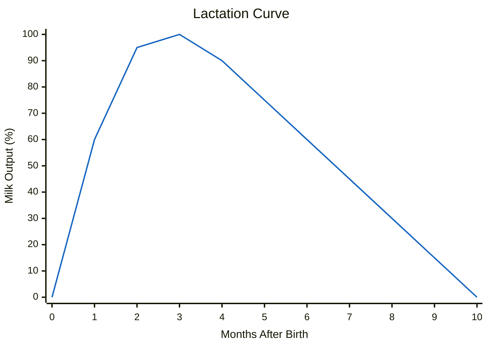

# Breeding Guide

Realistic Livestock RM replaces the base game's automatic reproduction with a realistic system requiring males and females, age requirements, health thresholds, and species-specific gestation periods. This guide covers everything you need to know about breeding.

> **Note:** This documentation was generated with AI assistance and may contain inaccuracies. If you spot an error, please [open an issue](https://github.com/rittermod/FS25_RealisticLivestockRM/issues).

---

## Requirements for Breeding

For reproduction to occur, ALL of the following must be true:

1. **Male and female** of the same species in the same pen (or artificial insemination)
2. Female has reached **minimum breeding age**
3. Male has not exceeded **maximum breeding age**
4. Female is **not already pregnant**
5. Female health is **75% or above**
6. Female is not the **daughter of that specific male** (inbreeding prevention)

---

## Breeding Ages & Gestation

| Species | Female Breeds From | Male Breeds From | Male Breeds Until | Gestation | Female Fertility Ends |
|---------|-------------------|-----------------|-------------------|-----------|----------------------|
| **Cattle** | 12 months | 12 months | 132 months (11 yr) | 10 months | 132 months (11 yr) |
| **Pigs** | 6 months | 8 months | **48 months (4 yr)** | 4 months | 96 months (8 yr) |
| **Sheep** | 8 months | 5 months | **72 months (6 yr)** | 5 months | 120 months (10 yr) |
| **Goats** | 16 months | 5 months | 72 months (6 yr) | 5 months | 120 months (10 yr) |
| **Horses** | 22 months | 36 months | 300 months (25 yr) | 11 months | 264 months (22 yr) |
| **Chickens** | 6 months | 6 months | No limit | 2 months | Declines with age |

> **Critical insight:** Males retire from breeding much earlier than females in some species! Boars stop at 4 years while sows breed until 8. Rams stop at 6 years while ewes breed until 10. Plan male replacements early.

---

## Breed Restrictions

Most males can breed with any female of their species, with two important exceptions:

| Male | Can Breed With |
|------|---------------|
| **Water Buffalo Bull** | Water Buffalo cows **only** |
| **Ram Goat** | Goats **only** |
| Any other Bull | Any cow breed (except Water Buffalo) |
| Any other Ram | Any sheep breed (except Goats) |
| All Boars | Any pig breed |
| All Stallions | Any horse colour |
| All Roosters | Any hen |

*Cross-breeding between different breeds of the same species is allowed (e.g., Angus bull × Holstein cow), except for breed-locked types.*

---

## Offspring per Birth

### Cattle

Cattle usually produce single calves. Twins and triplets are rare.

| Cow Age | No Birth | 1 Calf | Twins | Triplets |
|---------|----------|--------|-------|----------|
| 12–28 mo | Moderate | Most likely | Rare | Very rare |
| 29–48 mo (prime) | Low | Most likely | Rare | Very rare |
| 49–84 mo | Increasing | Most likely | Rare | Very rare |
| 85–132 mo (old) | Very common | Less likely | Very rare | Extremely rare |

### Pigs

Pigs produce the largest litters. Healthy sows at prime age almost always deliver.

| Sow Age | Chance of No Birth | Typical Litter | Large Litter |
|---------|-------------------|----------------|--------------|
| 6–12 mo (young) | Low | 11–13 piglets | 14–16 possible |
| 13–36 mo (prime) | Very low | 11–13 piglets | 14–16 possible |
| 37–60 mo | Low–moderate | 11–13 piglets | 14–16 possible |
| 61–80 mo | Moderate | 11–13 piglets | Fewer |
| 81–96 mo (old) | High | Small litters | Rare |

*Most pig litters are 11–13 piglets. Low health significantly reduces litter size.*

### Sheep & Goats

Sheep and goats have high twin rates at prime age. First-time mothers usually have singles.

| Ewe/Doe Age | Singles | Twins | Triplets |
|-------------|---------|-------|----------|
| First-time mother | Most likely | Uncommon | Rare |
| 18–36 mo | Common | Common | Rare |
| 36–72 mo (prime) | Less common | **Most likely** | Uncommon |
| 72–120 mo (old) | Uncommon | Most common | Rare |

*At prime age, twins are more common than singles! Goats follow the same pattern but start breeding later (16 months vs 8 months for sheep).*

### Horses

Horses almost always produce a single foal.

| Outcome | Likelihood |
|---------|------------|
| 1 foal | Almost always |
| Twins | Rare |
| Triplets | Very rare |

*Horse fertility declines gradually with age through to 264 months.*

### Chickens

Chickens have large but unreliable hatches. The chance of no offspring is always significant.

| Hen Age | No Hatch | Small Brood (1–5) | Typical Brood (5–7) | Large Brood (7–12) |
|---------|----------|-------------------|--------------------|--------------------|
| 6–12 mo | Common | Uncommon | Most likely | Possible |
| 12–24 mo | Common | Uncommon | Most likely | Possible |
| 24–48 mo | Frequent | Uncommon | Less likely | Rare |
| 48–84 mo | Very common | Rare | Rare | Very rare |
| 84+ mo | Almost always | Very rare | Very rare | — |

*Unlike other animals, hens never die during hatching.*

---

## Lactation

Cows and goats enter a lactation period after giving birth. This has major effects on both production and consumption.

| Parameter | Value |
|-----------|-------|
| Duration | 10 months after birth |
| Milk production | Only during lactation (zero otherwise) |
| Food consumption | Noticeably higher during lactation |
| Water consumption | Considerably higher during lactation |
| Sell price | Small bonus while lactating |

### Lactation Phase Curve

Milk output varies within the lactation period:

| Months Since Birth | Milk Output |
|-------------------|-------------|
| 0–1 | Ramping up (below full potential) |
| 2–3 | **Peak production** |
| 4–9 | Gradually declining |
| 10+ | Lactation ends (zero milk) |

*Peak milk production occurs around month 2–3 after birth. See the cattle and sheep factsheets for specific breed output ranges.*

*Chart shows the typical shape of the lactation curve. Actual litres depend on breed and genetics — see the cattle factsheet for specific ranges.*

---

## Pregnancy Complications

Breeding is not without risk. Low health significantly increases complications:

| Parent Health | Risk Level |
|--------------|------------|
| 90%+ | Very low risk of complications |
| 75–90% | Low risk |
| 60–75% | Moderate risk, fewer offspring |
| Below 60% | High risk, mother may die during birth |

*If the mother dies during birth, offspring may still survive. Low health also reduces the chance of multiple offspring.*

---

## Pen Capacity

If a pen is at maximum capacity when offspring are born, **excess newborns are automatically sold**. Make sure your pens have room for new arrivals, especially:

- Pig pens (litters of 11–16)
- Sheep pens at prime age (frequent twins)
- Any pen during peak breeding season

---

## Artificial Insemination

If you don't want to keep males, artificial insemination (AI) is available through the herdsman menu:

- Breeds your female without needing a physical male in the pen
- Uses an AI animal pool (can be refreshed in settings)
- Same breed restrictions apply (Water Buffalo and Goats need breed-specific AI)
- Same health and age requirements apply

---

## Breeding Calendar

Plan your breeding based on gestation periods:

| Species | Breed | Birth | Next Possible Breeding |
|---------|-------|-------|----------------------|
| Cattle | Month 0 | Month 10 | ~Month 12 (after lactation) |
| Pigs | Month 0 | Month 4 | ~Month 5 |
| Sheep | Month 0 | Month 5 | ~Month 6 |
| Horses | Month 0 | Month 11 | ~Month 12 |
| Chickens | Month 0 | Month 2 | ~Month 3 |

*Cows have the longest cycle — roughly one calf per year at best. Pigs can produce 2–3 litters per year, making them the fastest-reproducing large animal.*

---

## Tips

1. **Track male ages.** The #1 surprise is boars stopping at 4 years. Set up reminders or check your boar ages regularly.

2. **Breed for genetics.** Offspring inherit from parents. Pair your best animals and sell poor-genetics offspring for a steady improvement each generation.

3. **Keep health above 75%.** Below 75%, breeding fails entirely. Below 60%, the mother risks death. Good food, water, straw, and medical treatment are essential.

4. **Budget for lactation costs.** Lactating cows eat noticeably more food and considerably more water. Plan your feed budget for the 10-month lactation window.

5. **Use pen capacity wisely.** A pig sow can produce 13 piglets at once. If your pen only has 5 spaces, 8 piglets get auto-sold at newborn prices. Expand pens before breeding season.
